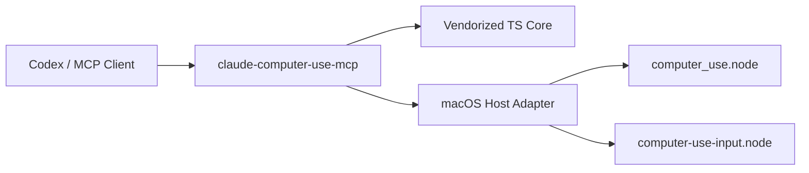

<p align="center">
  
</p>

<p align="center">
  <a href="./README.md">English</a> | <a href="./README.zh-CN.md">简体中文</a> | 日本語
</p>

<p align="center">
  <a href="https://github.com/wimi321/claude-computer-use-mcp"></a>
  <a href="https://www.npmjs.com/"></a>
  <a href="./LICENSE"></a>
  <a href="./skill/computer-use-macos/SKILL.md"></a>
</p>

<h1 align="center">claude-computer-use-mcp</h1>

<p align="center">
  Claude Code の <code>computer use</code> 実装から抽出した、独立した macOS Computer Use MCP サーバーです。
</p>

<p align="center">
  製品内部に埋め込まれていた機能を、独立した GitHub プロジェクトとして再構成し、実運用しやすい形にまとめています。
</p>

## 概要

- stdio ベースの standalone MCP server
- 抽出した `computer-use-mcp` TypeScript コア
- macOS CLI host adapter
- session state と lock handling
- Codex skill 同梱
- native モジュールは明示的に外部注入

## このプロジェクトの目的

Claude Code にはすでに強力な macOS computer-use スタックがあります。

- スクリーンショット取得
- アプリ探索と解決
- マウス / キーボード制御
- 権限 tier ロジック
- ディスプレイ対応の座標変換
- セッション間ロック
- MCP tool schema / dispatch

このプロジェクトは、その再利用可能な層を独立リポジトリとして切り出し、研究・統合・拡張しやすい形にするためのものです。

## 含まれるもの

- standalone MCP server entrypoint
- vendorized `computer-use-mcp` TypeScript 層
- macOS host adapter
- session / lock ロジック
- Codex skill
- MCP / env サンプル

## 含まれないもの

- 低レベル入力 / スクリーンショット制御に必要な native `.node` バイナリ

そのため、ランタイムでは以下の環境変数が必要です。

```bash
export COMPUTER_USE_SWIFT_NODE_PATH="/absolute/path/to/computer_use.node"
export COMPUTER_USE_INPUT_NODE_PATH="/absolute/path/to/computer-use-input.node"
```

## Quick Start

```bash
npm install
npm run build
node dist/cli.js
```

実行前に native モジュールのパスを設定してください。

## MCP 設定例

- [examples/mcp-config.json](./examples/mcp-config.json)

## アーキテクチャ



## 重要な注意点

- この standalone host では `request_access` が auto-approve です
- 元の Claude Code デスクトップ承認 UI は含まれていません
- trusted local workflow 向けです
- native モジュールがなければ fail fast します

## Codex Skill

- [skill/computer-use-macos/SKILL.md](./skill/computer-use-macos/SKILL.md)

## 制限

- macOS 専用
- native `.node` は未同梱
- desktop approval UI なし
- 完全 self-contained な npm package ではない

## 開発

```bash
npm run build
npm run check
```

## クレジット

このリポジトリは Claude Code の `computer use` 実装をローカルに抽出し、再構成したものです。
