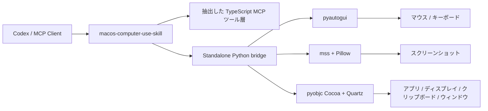

<div align="center">
  
  <h1>macOS Computer-Use Skill</h1>
  <p><strong>macOS 向けのトップレベル portable skill。standalone runtime と MCP server を同梱しています。</strong></p>
  <p>
    <a href="https://github.com/wimi321/macos-computer-use-skill">GitHub</a>
    ·
    <a href="https://clawhub.ai/wimi321/computer-use-macos">ClawHub</a>
    ·
    <a href="./README.md">English</a>
    ·
    <a href="./README.zh-CN.md">简体中文</a>
  </p>
</div>

## ClawHub からインストール

この skill は ClawHub に [`computer-use-macos`](https://clawhub.ai/wimi321/computer-use-macos) として公開済みです。

```bash
clawhub install computer-use-macos
```

ソース一式も欲しい場合は、このまま GitHub セットアップを参照してください。

## このプロジェクトの位置づけ

このリポジトリは同時に:

- トップレベルの `skill`
- 独立した macOS runtime
- agent エコシステム向けの computer-use MCP server

として設計されています。Codex 専用ではなく、skill という配布形態そのものをポータブルにしています。

## このプロジェクトの目的

目標は明確です。

- ローカル Claude に依存しない
- private な `.node` バイナリに依存しない
- どこかのインストール済み Claude から内部資産を拾わない
- skill を入れたら、そのまま computer use が動く

このリポジトリはその前提で再構成されています。

## できること

- トップレベル macOS computer-use skill
- スクリーンショット、マウス、キーボード、アプリ起動、ウィンドウ/ディスプレイ情報、クリップボードを扱う standalone MCP server
- 公開依存のみ: `Node.js + Python + pyautogui + mss + Pillow + pyobjc`
- 初回起動時に `.runtime/venv` を自動作成し、Python 依存を自動インストール
- `~/.codex/skills/computer-use-macos/project` に本体まで配置される skill install
- 抽出した TypeScript computer-use ツール層を維持しつつ、実行バックエンドを完全独立化

## ローカル検証済み

macOS 上で以下を実機確認しました。

- runtime bootstrap
- 権限チェック
- ディスプレイ列挙
- スクリーンショット取得
- 最前面アプリ検出
- ポインタ下アプリ検出
- ウィンドウとディスプレイの対応付け
- クリップボード読み書き
- 入力経路の smoke test
- MCP server 起動

## アーキテクチャ



## インストール

### 1. クローンして Node 依存を入れる

```bash
git clone https://github.com/wimi321/macos-computer-use-skill.git
cd macos-computer-use-skill
npm install
npm run build
```

### 2. サーバーを起動

```bash
node dist/cli.js
```

初回起動時に自動で以下を実行します。

- `.runtime/venv` の作成
- 必要なら `pip` の bootstrap
- `runtime/requirements.txt` に基づく Python 依存の導入

Claude Desktop も private native module も不要です。

## MCP 設定

```json
{
  "mcpServers": {
    "computer-use": {
      "command": "node",
      "args": [
        "/absolute/path/to/macos-computer-use-skill/dist/cli.js"
      ],
      "env": {
        "CLAUDE_COMPUTER_USE_DEBUG": "0",
        "CLAUDE_COMPUTER_USE_COORDINATE_MODE": "pixels"
      }
    }
  }
}
```

参考: [`examples/mcp-config.json`](./examples/mcp-config.json)

## Skill インストール

同梱 skill: [`skill/computer-use-macos`](./skill/computer-use-macos)

ClawHub から直接入れる方法と、このリポジトリから入れる方法の両方があります。

### Option A: ClawHub からインストール

```bash
clawhub install computer-use-macos
```

### Option B: リポジトリからインストール

```bash
bash skill/computer-use-macos/scripts/install.sh
```

インストーラは以下をまとめてコピーします。

- skill メタデータ
- standalone プロジェクト本体
- runtime bootstrap ファイル

インストール後の既定パス:

```bash
~/.codex/skills/computer-use-macos/project
```

つまり元の clone が消えても、インストール済み skill 側のプロジェクトで動かせます。

## 実行メモ

### 権限

macOS では引き続き以下が必要です。

- Accessibility
- Screen Recording

この standalone host は MCP フローの中で両方を確認します。

### スクリーンショット filtering

この runtime は `screenshotFiltering: none` を返します。

つまり:

- スクリーンショット自体は compositor レベルでは絞り込まれない
- その代わり allowlist / tier / action gate は MCP 側で継続して適用される

### 対応プラットフォーム

この実装は現在 `macOS only` です。Windows や Linux 向け backend はまだ含まれていません。

## 主要コマンド

```bash
npm run build
node dist/cli.js
```

```bash
node --input-type=module -e "import { callPythonHelper } from './dist/computer-use/pythonBridge.js'; console.log(await callPythonHelper('list_displays', {}));"
```

## リポジトリ構成

```text
src/
  computer-use/
    executor.ts
    hostAdapter.ts
    pythonBridge.ts
  vendor/computer-use-mcp/
runtime/
  mac_helper.py
  requirements.txt
skill/
  computer-use-macos/
examples/
assets/
```

## 任意の環境変数

- `CLAUDE_COMPUTER_USE_DEBUG=1`
- `CLAUDE_COMPUTER_USE_COORDINATE_MODE=pixels`
- `CLAUDE_COMPUTER_USE_CLIPBOARD_PASTE=1`
- `CLAUDE_COMPUTER_USE_MOUSE_ANIMATION=1`
- `CLAUDE_COMPUTER_USE_HIDE_BEFORE_ACTION=0`

## Roadmap

- app icon 抽出の改善
- nested helper app のフィルタ精度向上
- MCP 統合テストの拡充
- 配布しやすいリリース成果物の追加

## License

MIT

## Credits

Claude Code computer-use ワークフローから再利用可能な TypeScript ロジックを抽出し、そこに完全独立の公開 macOS runtime を接続したプロジェクトです。
