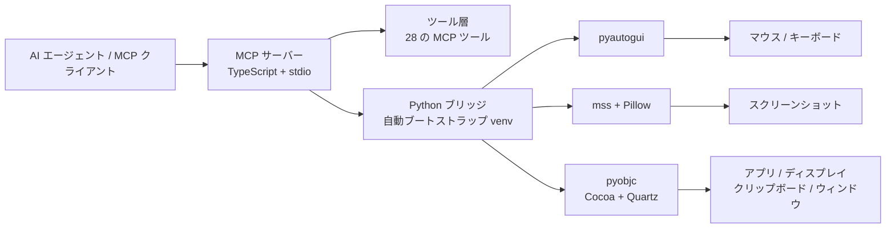

<p align="right">
  <a href="./README.md">English</a> ·
  <a href="./README.zh-CN.md">简体中文</a>
</p>

<div align="center">
  
  <h1>macOS Computer-Use Skill</h1>
  <p><strong>AI エージェントに macOS の GUI 操作を丸ごと渡すスタンドアロン MCP サーバー — スクリーンショット、マウス、キーボード、アプリ、クリップボード、マルチディスプレイ — プライベート依存ゼロ。</strong></p>
  <br />
  <p>
    
    
    
    
    
    
  </p>
  <p>
    <a href="#クイックスタート">クイックスタート</a> ·
    <a href="#ツール一覧">ツール一覧</a> ·
    <a href="#mcp-設定">MCP 設定</a> ·
    <a href="https://clawhub.ai/wimi321/computer-use-macos">ClawHub</a>
  </p>
</div>

---

## 主な機能

| | 機能 | 説明 |
|---|---|---|
| **視覚** | スクリーンショット & ディスプレイ | 任意のディスプレイをキャプチャ、モニター列挙、領域ズーム |
| **入力** | マウス & キーボード | クリック、ドラッグ、スクロール、テキスト入力、キーコンボ、長押し — IME セーフなクリップボードルーティング内蔵 |
| **アプリ** | アプリケーション制御 | アプリ起動、最前面アプリ検出、インストール済み/実行中アプリ一覧、ティア型権限モデル |
| **クリップボード** | 読み書き | フルクリップボードアクセスでペーストベースのワークフローに対応 |
| **バッチ** | アクションバッチ処理 | 単一の MCP 呼び出しで複数アクションをチェーン実行 |
| **ランタイム** | ゼロコンフィグ起動 | 初回実行時に Python virtualenv を自動作成、依存を自動インストール |
| **ポータブル** | Skill パッケージング | スタンドアロン skill として配布 — インストールだけで動作、ソースリポジトリ不要 |
| **パブリック** | プライベート依存なし | すべて公開パッケージで構築: Node.js, Python, pyautogui, mss, Pillow, pyobjc |

## クイックスタート

**1. クローン & ビルド**

```bash
git clone https://github.com/wimi321/macos-computer-use-skill.git
cd macos-computer-use-skill
npm install && npm run build
```

**2. MCP サーバーを起動**

```bash
node dist/cli.js
```

初回起動時、サーバーは `.runtime/venv` に Python 仮想環境を自動作成し、すべてのランタイム依存をインストールします。Claude デスクトップアプリもプライベートネイティブモジュールも不要です。

**3. または ClawHub からインストール**

```bash
clawhub install computer-use-macos
```

> [!NOTE]
> macOS ではホストプロセスに**アクセシビリティ**と**画面収録**の権限が必要です。サーバーは起動時に両方をチェックし、MCP 経由でステータスを報告します。

## アーキテクチャ



## ツール一覧

### 視覚 & ディスプレイ

| ツール | 説明 |
|---|---|
| `screenshot` | 現在のディスプレイを JPEG 画像としてキャプチャ |
| `zoom` | 最後のスクリーンショットの指定領域を切り出してズーム |
| `switch_display` | キャプチャ対象を別のモニターに切り替え |

### 入力

| ツール | 説明 |
|---|---|
| `left_click` | 指定座標で左クリック |
| `double_click` | ダブルクリック |
| `triple_click` | トリプルクリック（段落/行選択） |
| `right_click` | 右クリック（コンテキストメニュー） |
| `middle_click` | 中ボタンクリック |
| `left_click_drag` | 2 点間をドラッグ |
| `left_mouse_down` | 左ボタンを押下して保持 |
| `left_mouse_up` | 左ボタンを離す |
| `mouse_move` | クリックせずにカーソルを移動 |
| `scroll` | 指定座標で任意の方向にスクロール |
| `type` | テキスト入力（macOS ではクリップボードルーティングで IME 問題を回避） |
| `key` | キーコンボ（例: `cmd+c`、`ctrl+shift+t`） |
| `hold_key` | キーを一定時間押し続ける |
| `cursor_position` | 現在のカーソル座標を取得 |

### アプリケーション & システム

| ツール | 説明 |
|---|---|
| `open_application` | 名前で macOS アプリを起動 |
| `request_access` | アプリとの対話権限をリクエスト |
| `list_granted_applications` | 現在のセッションで制御が許可されたアプリ一覧 |
| `read_clipboard` | システムクリップボードを読み取り |
| `write_clipboard` | システムクリップボードに書き込み |
| `wait` | 指定時間ポーズ |

### バッチ & ティーチモード

| ツール | 説明 |
|---|---|
| `computer_batch` | 単一呼び出しで複数アクションを実行 |
| `request_teach_access` | ティーチワークフロー用の昇格権限をリクエスト |
| `teach_step` | ティーチモードでのシングルステップアクション |
| `teach_batch` | ティーチモードでのバッチアクション |

## MCP 設定

MCP クライアントの設定に追加してください：

```json
{
  "mcpServers": {
    "computer-use": {
      "command": "node",
      "args": ["/absolute/path/to/macos-computer-use-skill/dist/cli.js"],
      "env": {
        "CLAUDE_COMPUTER_USE_DEBUG": "0",
        "CLAUDE_COMPUTER_USE_COORDINATE_MODE": "pixels"
      }
    }
  }
}
```

すぐ使えるテンプレートは [`examples/mcp-config.json`](./examples/mcp-config.json) を参照してください。

## Skill インストール

本プロジェクトは自己完結型 skill として [`skill/computer-use-macos`](./skill/computer-use-macos) に同梱されています。

**ClawHub からインストール：**

```bash
clawhub install computer-use-macos
```

**リポジトリからインストール：**

```bash
bash skill/computer-use-macos/scripts/install.sh
```

インストーラはプロジェクト一式を `~/.codex/skills/computer-use-macos/project` にコピーします。元のクローンを削除しても skill は動作し続けます。

## 環境変数

| 変数 | デフォルト | 説明 |
|---|---|---|
| `CLAUDE_COMPUTER_USE_DEBUG` | `0` | 詳細デバッグログを有効化 |
| `CLAUDE_COMPUTER_USE_COORDINATE_MODE` | `pixels` | 座標モード: `pixels` または `normalized_0_100` |
| `CLAUDE_COMPUTER_USE_CLIPBOARD_PASTE` | `1` | クリップボードベースの入力を優先（IME セーフ） |
| `CLAUDE_COMPUTER_USE_MOUSE_ANIMATION` | `0` | マウス移動アニメーション |
| `CLAUDE_COMPUTER_USE_HIDE_BEFORE_ACTION` | `0` | アクション前にオーバーレイウィンドウを非表示 |

## システム要件

| 要件 | バージョン |
|---|---|
| macOS | 12+（Monterey 以降） |
| Node.js | 20+ |
| Python | 3.10+（macOS 付属または Homebrew 経由） |
| 権限 | アクセシビリティ + 画面収録 |

Python 依存（`pyautogui`、`mss`、`Pillow`、`pyobjc`）は初回実行時に独立した仮想環境へ自動インストールされます。

## リポジトリ構成

```
macos-computer-use-skill/
├── src/
│   ├── cli.ts                    # エントリーポイント
│   ├── server.ts                 # MCP サーバー設定
│   ├── session.ts                # セッションコンテキストファクトリ
│   ├── computer-use/
│   │   ├── executor.ts           # macOS エグゼキュータ（Python へブリッジ）
│   │   ├── pythonBridge.ts       # Venv ブートストラップ + Python IPC
│   │   ├── hostAdapter.ts        # ホストアダプターファクトリ
│   │   └── ...
│   └── vendor/computer-use-mcp/
│       ├── mcpServer.ts          # MCP サーバーファクトリ
│       ├── toolCalls.ts          # ツールディスパッチロジック
│       ├── tools.ts              # MCP ツールスキーマ
│       └── ...
├── runtime/
│   ├── mac_helper.py             # Python ランタイム（pyautogui + pyobjc）
│   └── requirements.txt
├── skill/
│   └── computer-use-macos/       # ポータブル skill パッケージ
├── examples/
│   ├── mcp-config.json
│   └── env.sh.example
├── assets/
│   └── hero.svg
├── package.json
└── tsconfig.json
```

## ロードマップ

- [ ] プライベート API 不要のアプリアイコン抽出
- [ ] ネストされた helper アプリのフィルタリング強化
- [ ] 自動化 MCP 統合テストスイート
- [ ] 配布を簡素化するビルド済みリリース成果物

## コントリビュート

コントリビュートを歓迎します。ガイドラインは [CONTRIBUTING.md](./CONTRIBUTING.md) を参照してください。

## License

[MIT](./LICENSE)

## 謝辞

本プロジェクトは Claude Code ワークフローから再利用可能な TypeScript computer-use ロジックを抽出し、プライベートなネイティブランタイムを完全に独立した公開インストール可能な macOS 実装に置き換えたものです。[Model Context Protocol](https://modelcontextprotocol.io) の上に構築されています。
