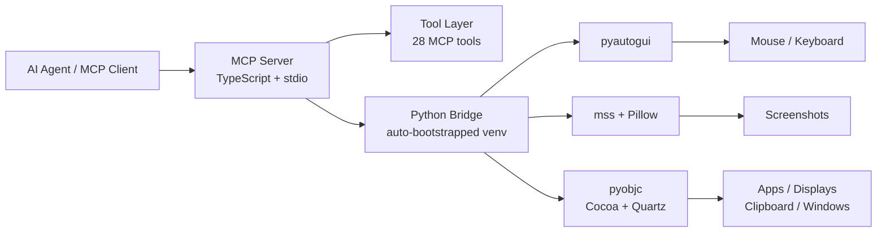

<p align="right">
  <a href="./README.zh-CN.md">简体中文</a> ·
  <a href="./README.ja.md">日本語</a>
</p>

<div align="center">
  
  <h1>macOS Computer-Use Skill</h1>
  <p><strong>Standalone MCP server that gives AI agents full GUI control over macOS — screenshots, mouse, keyboard, apps, clipboard, and multi-display — with zero private dependencies.</strong></p>
  <br />
  <p>
    
    
    
    
    
    
  </p>
  <p>
    <a href="#quick-start">Quick Start</a> ·
    <a href="#available-tools">Tools</a> ·
    <a href="#mcp-configuration">MCP Config</a> ·
    <a href="https://clawhub.ai/wimi321/computer-use-macos">ClawHub</a>
  </p>
</div>

---

## Features

| | Feature | Description |
|---|---|---|
| **Vision** | Screenshot & Display | Capture any display, enumerate monitors, zoom into regions |
| **Input** | Mouse & Keyboard | Click, drag, scroll, type, key combos, hold keys — with IME-safe clipboard routing |
| **Apps** | Application Control | Launch apps, detect frontmost app, list installed/running apps, tiered permission model |
| **Clipboard** | Read & Write | Full clipboard access for paste-based workflows |
| **Batch** | Action Batching | Chain multiple actions in a single MCP call for speed |
| **Runtime** | Zero-Config Bootstrap | Auto-creates Python virtualenv and installs dependencies on first run |
| **Portable** | Skill Packaging | Ships as a standalone skill — install once, works without the source repo |
| **Public** | No Private Dependencies | Built entirely on public packages: Node.js, Python, pyautogui, mss, Pillow, pyobjc |

## Quick Start

**1. Clone & build**

```bash
git clone https://github.com/wimi321/macos-computer-use-skill.git
cd macos-computer-use-skill
npm install && npm run build
```

**2. Run the MCP server**

```bash
node dist/cli.js
```

On first launch the server automatically creates a Python virtualenv in `.runtime/venv` and installs all runtime dependencies. No Claude desktop app, no private native modules.

**3. Or install from ClawHub**

```bash
clawhub install computer-use-macos
```

> [!NOTE]
> macOS requires **Accessibility** and **Screen Recording** permissions for the host process. The server checks both on startup and reports status through MCP.

## Architecture



## Available Tools

### Vision & Display

| Tool | Description |
|---|---|
| `screenshot` | Capture the current display as a JPEG image |
| `zoom` | Crop and zoom into a region of the last screenshot |
| `switch_display` | Switch the active capture target to a different monitor |

### Input

| Tool | Description |
|---|---|
| `left_click` | Left-click at a coordinate |
| `double_click` | Double-click at a coordinate |
| `triple_click` | Triple-click (select paragraph/line) |
| `right_click` | Right-click (context menu) |
| `middle_click` | Middle-click |
| `left_click_drag` | Click-and-drag between two points |
| `left_mouse_down` | Press and hold the left mouse button |
| `left_mouse_up` | Release the left mouse button |
| `mouse_move` | Move the cursor without clicking |
| `scroll` | Scroll in any direction at a coordinate |
| `type` | Type text (clipboard-routed on macOS to avoid IME corruption) |
| `key` | Press a key combo (e.g. `cmd+c`, `ctrl+shift+t`) |
| `hold_key` | Hold a key for a duration |
| `cursor_position` | Get the current cursor coordinates |

### Application & System

| Tool | Description |
|---|---|
| `open_application` | Launch a macOS application by name |
| `request_access` | Request access to interact with an application |
| `list_granted_applications` | List apps the current session has permission to control |
| `read_clipboard` | Read the system clipboard |
| `write_clipboard` | Write to the system clipboard |
| `wait` | Pause for a specified duration |

### Batch & Teach Mode

| Tool | Description |
|---|---|
| `computer_batch` | Execute multiple actions in a single call |
| `request_teach_access` | Request elevated access for teaching workflows |
| `teach_step` | Single-step action in teach mode |
| `teach_batch` | Batch actions in teach mode |

## MCP Configuration

Add to your MCP client config:

```json
{
  "mcpServers": {
    "computer-use": {
      "command": "node",
      "args": ["/absolute/path/to/macos-computer-use-skill/dist/cli.js"],
      "env": {
        "CLAUDE_COMPUTER_USE_DEBUG": "0",
        "CLAUDE_COMPUTER_USE_COORDINATE_MODE": "pixels"
      }
    }
  }
}
```

See [`examples/mcp-config.json`](./examples/mcp-config.json) for a ready-to-use template.

## Skill Install

This project ships as a self-contained skill at [`skill/computer-use-macos`](./skill/computer-use-macos).

**From ClawHub:**

```bash
clawhub install computer-use-macos
```

**From the repo:**

```bash
bash skill/computer-use-macos/scripts/install.sh
```

The installer copies the full project to `~/.codex/skills/computer-use-macos/project` — the skill keeps working even if the original clone is removed.

## Environment Variables

| Variable | Default | Description |
|---|---|---|
| `CLAUDE_COMPUTER_USE_DEBUG` | `0` | Enable verbose debug logging |
| `CLAUDE_COMPUTER_USE_COORDINATE_MODE` | `pixels` | Coordinate mode: `pixels` or `normalized_0_100` |
| `CLAUDE_COMPUTER_USE_CLIPBOARD_PASTE` | `1` | Prefer clipboard-based typing (IME-safe) |
| `CLAUDE_COMPUTER_USE_MOUSE_ANIMATION` | `0` | Animate mouse movement |
| `CLAUDE_COMPUTER_USE_HIDE_BEFORE_ACTION` | `0` | Hide overlay windows before actions |

## Requirements

| Requirement | Version |
|---|---|
| macOS | 12+ (Monterey or later) |
| Node.js | 20+ |
| Python | 3.10+ (ships with macOS or via Homebrew) |
| Permissions | Accessibility + Screen Recording |

Python dependencies (`pyautogui`, `mss`, `Pillow`, `pyobjc`) are installed automatically into an isolated virtualenv on first run.

## Repository Layout

```
macos-computer-use-skill/
├── src/
│   ├── cli.ts                    # Entry point
│   ├── server.ts                 # MCP server setup
│   ├── session.ts                # Session context factory
│   ├── computer-use/
│   │   ├── executor.ts           # macOS executor (bridges to Python)
│   │   ├── pythonBridge.ts       # Venv bootstrap + Python IPC
│   │   ├── hostAdapter.ts        # Host adapter factory
│   │   └── ...
│   └── vendor/computer-use-mcp/
│       ├── mcpServer.ts          # MCP server factory
│       ├── toolCalls.ts          # Tool dispatch logic
│       ├── tools.ts              # MCP tool schemas
│       └── ...
├── runtime/
│   ├── mac_helper.py             # Python runtime (pyautogui + pyobjc)
│   └── requirements.txt
├── skill/
│   └── computer-use-macos/       # Portable skill package
├── examples/
│   ├── mcp-config.json
│   └── env.sh.example
├── assets/
│   └── hero.svg
├── package.json
└── tsconfig.json
```

## Roadmap

- [ ] App icon extraction without private APIs
- [ ] Stronger nested helper-app filtering
- [ ] Automated MCP integration test suite
- [ ] Pre-built release artifacts for easier distribution

## Contributing

Contributions are welcome. See [CONTRIBUTING.md](./CONTRIBUTING.md) for guidelines.

## License

[MIT](./LICENSE)

## Acknowledgments

This project extracts and adapts reusable TypeScript computer-use logic from the Claude Code workflow, replacing the private native runtime with a fully standalone, publicly installable macOS implementation. Built on top of the [Model Context Protocol](https://modelcontextprotocol.io).
