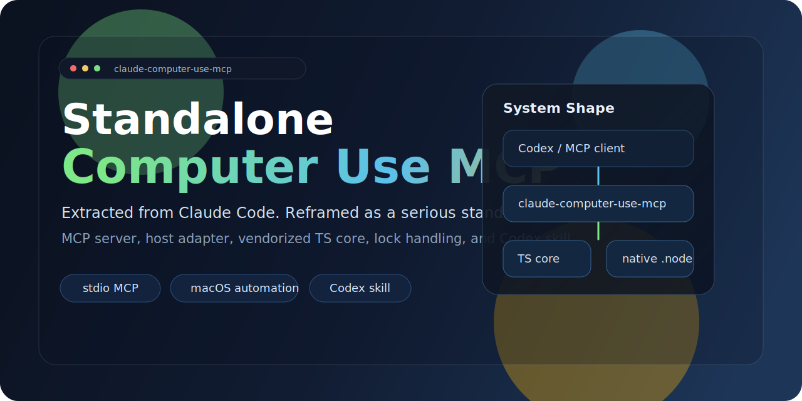
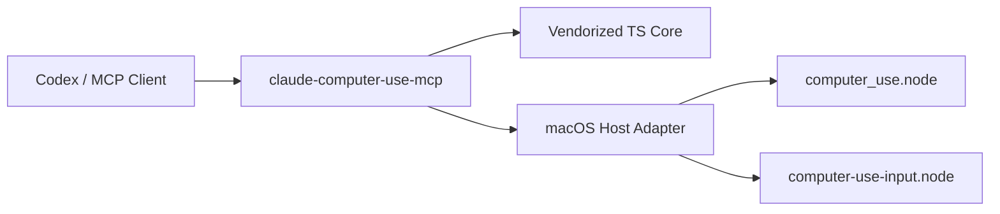

<p align="center">
  
</p>

<p align="center">
  English | <a href="./README.zh-CN.md">简体中文</a> | <a href="./README.ja.md">日本語</a>
</p>

<p align="center">
  <a href="https://github.com/wimi321/claude-computer-use-mcp"></a>
  <a href="https://www.npmjs.com/"></a>
  <a href="./LICENSE"></a>
  <a href="./skill/computer-use-macos/SKILL.md"></a>
</p>

<h1 align="center">claude-computer-use-mcp</h1>

<p align="center">
  A standalone macOS Computer Use MCP server extracted from the <code>computer use</code> implementation inside Claude Code.
</p>

<p align="center">
  It takes an embedded product capability and turns it into a top-level GitHub project with a real server entrypoint, vendorized TypeScript core, macOS host adapter, and a first-class Codex skill.
</p>

## At A Glance

- standalone MCP server over stdio
- extracted `computer-use-mcp` TypeScript surface
- macOS CLI host adapter
- session lock and state handling
- Codex skill for local workflows
- explicit native-module injection instead of fake packaging

## Why This Exists

Claude Code already shipped a serious macOS computer-use stack:

- screenshot capture
- app discovery and resolution
- mouse and keyboard control
- permission-tier logic
- display-aware coordinate handling
- lock protection between sessions
- MCP tool schemas and dispatch

That implementation lived inside the product. This repository extracts the reusable orchestration layer into an independent project so it can be studied, adapted, and integrated into other local agent environments.

## What This Repo Actually Contains

### Included

- standalone MCP server entrypoint
- extracted `computer-use-mcp` TypeScript logic
- host-side macOS executor wrapper
- session state and file-lock handling
- Codex skill package
- buildable TypeScript source tree
- example MCP config and env templates

### Not Included

- the original native `.node` binaries used for low-level screenshot and input control

Those binaries were not present in the extracted local source tree, so this project deliberately exposes clear runtime injection points instead of pretending the repository is more complete than it is.

## Project Personality

This repo is optimized for people who care about the difference between:

- "I copied some internal files into a folder"
- and "I turned a buried subsystem into a credible standalone project"

That means the project tries to be honest, legible, and extensible:

- honest about missing native pieces
- legible in structure and architecture
- extensible for local agent and MCP experimentation

## Quick Start

### 1. Install dependencies

```bash
npm install
```

### 2. Point the server at the native modules

```bash
export COMPUTER_USE_SWIFT_NODE_PATH="/absolute/path/to/computer_use.node"
export COMPUTER_USE_INPUT_NODE_PATH="/absolute/path/to/computer-use-input.node"
```

### 3. Build

```bash
npm run build
```

### 4. Run

```bash
node dist/cli.js
```

## Drop-In MCP Example

Use [examples/mcp-config.json](./examples/mcp-config.json) as a starting point.

```json
{
  "mcpServers": {
    "computer-use": {
      "command": "node",
      "args": [
        "/absolute/path/to/claude-computer-use-mcp/dist/cli.js"
      ],
      "env": {
        "COMPUTER_USE_SWIFT_NODE_PATH": "/absolute/path/to/computer_use.node",
        "COMPUTER_USE_INPUT_NODE_PATH": "/absolute/path/to/computer-use-input.node",
        "CLAUDE_COMPUTER_USE_COORDINATE_MODE": "pixels"
      }
    }
  }
}
```

## Runtime Configuration

Required:

```bash
export COMPUTER_USE_SWIFT_NODE_PATH="/absolute/path/to/computer_use.node"
export COMPUTER_USE_INPUT_NODE_PATH="/absolute/path/to/computer-use-input.node"
```

Optional:

```bash
export CLAUDE_COMPUTER_USE_DEBUG=1
export CLAUDE_COMPUTER_USE_ENABLED=1
export CLAUDE_COMPUTER_USE_COORDINATE_MODE=pixels
export CLAUDE_COMPUTER_USE_PIXEL_VALIDATION=0
export CLAUDE_COMPUTER_USE_HIDE_BEFORE_ACTION=1
export CLAUDE_COMPUTER_USE_AUTO_TARGET_DISPLAY=1
export CLAUDE_COMPUTER_USE_CLIPBOARD_GUARD=1
```

There is also a copy-pasteable shell template at [examples/env.sh.example](./examples/env.sh.example).

## Architecture



### Public Layer

This repo contains the reusable orchestration layer:

- MCP tool definitions
- tool dispatch
- session binding
- executor interface
- host adapter
- lock handling
- skill packaging

### Native Layer

The real device-control implementation is expected to come from:

- `COMPUTER_USE_SWIFT_NODE_PATH`
- `COMPUTER_USE_INPUT_NODE_PATH`

That separation is intentional. It keeps the repository honest about what was recoverable and what still depends on original native artifacts.

## Project Layout

```text
.
├── assets/hero.svg                  # repo banner
├── examples/                        # MCP and env examples
├── skill/computer-use-macos/        # top-level Codex skill
├── src/cli.ts                       # server entrypoint
├── src/server.ts                    # MCP server wiring
├── src/session.ts                   # session state + permission behavior
├── src/computer-use/                # macOS host-side adapter code
├── src/lib/                         # local utilities
└── src/vendor/computer-use-mcp/     # extracted TS computer-use layer
```

## Codex Skill

The top-level Codex skill is included at:

- [skill/computer-use-macos/SKILL.md](./skill/computer-use-macos/SKILL.md)

Install it locally:

```bash
mkdir -p "$HOME/.codex/skills/computer-use-macos"
rsync -a skill/computer-use-macos/ "$HOME/.codex/skills/computer-use-macos/"
```

## Important Behavior Differences

This standalone adaptation is intentionally pragmatic.

- `request_access` is auto-approved inside this host
- the original Claude Code permission UI is not bundled here
- this is best treated as trusted-local infrastructure
- startup fails fast when native module paths are missing

## Limitations

- macOS only
- native `.node` binaries are not included
- no bundled desktop approval UI
- not yet packaged as a totally self-contained npm distribution
- best suited to local power-user, research, and agent-tooling workflows

## Roadmap

- add pluggable approval callbacks instead of unconditional auto-approve
- support cleaner native-module packaging
- add more MCP client integration recipes
- make embedding easier in other local agent runtimes
- document a reproducible path for reconnecting native binaries

## Development

Build:

```bash
npm run build
```

Type-check only:

```bash
npm run check
```

The server intentionally fails with a clear error when native paths are missing. That is by design.

## Attribution

This repository was extracted and adapted from the Claude Code `computer use` implementation found in the local recovered source tree available during extraction.

It preserves and repackages the reusable TypeScript and host-logic layer, while leaving the unavailable native pieces as explicit runtime dependencies.
