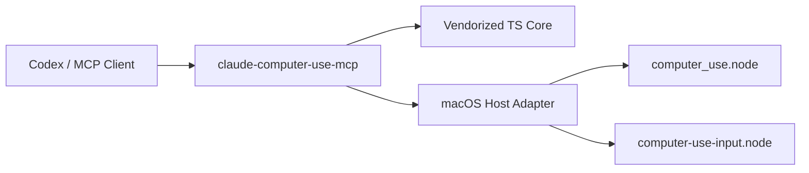

<p align="center">
  
</p>

<p align="center">
  <a href="./README.md">English</a> | 简体中文 | <a href="./README.ja.md">日本語</a>
</p>

<p align="center">
  <a href="https://github.com/wimi321/claude-computer-use-mcp"></a>
  <a href="https://www.npmjs.com/"></a>
  <a href="./LICENSE"></a>
  <a href="./skill/computer-use-macos/SKILL.md"></a>
</p>

<h1 align="center">claude-computer-use-mcp</h1>

<p align="center">
  一个从 Claude Code <code>computer use</code> 能力中抽离出来的独立 macOS Computer Use MCP Server。
</p>

<p align="center">
  它把原本埋在产品内部的一套能力，重构成一个真正像顶级 GitHub 项目的独立仓库：有独立入口、有清晰架构、有可复用 TypeScript 核心，也有配套的 Codex Skill。
</p>

## 一眼看懂

- 独立的 stdio MCP Server
- 抽离后的 `computer-use-mcp` TypeScript 核心
- macOS CLI host adapter
- session 状态和锁控制
- 顶级 Codex skill
- 明确的 native 模块注入方案，而不是假装“已经完整开源”

## 为什么要做这个项目

Claude Code 内部其实已经有一套很强的 macOS computer-use 能力：

- 截图采集
- 应用发现与解析
- 鼠标和键盘控制
- 权限分级逻辑
- 多显示器坐标处理
- 会话级锁保护
- MCP tool schema 与调度

但这些能力原本是产品内嵌实现，不是一个可以直接复用的顶级仓库。这个项目的目标，就是把其中可抽离、可理解、可扩展的那一层，整理成一个独立 GitHub 项目。

## 这个仓库到底包含什么

### 已包含

- 独立 MCP server 入口
- 抽离后的 `computer-use-mcp` TypeScript 逻辑
- host 侧 macOS executor wrapper
- session 状态与文件锁逻辑
- Codex skill
- 可构建的 TypeScript 工程
- MCP 配置示例和环境变量模板

### 未包含

- 原始低层输入与截图所依赖的 native `.node` 二进制

原因很直接：这些 `.node` 文件并不在当前提取出来的源码树里，所以仓库选择诚实暴露注入点，而不是伪装成“开箱即用且已全部公开”。

## 项目特性

- 基于 stdio 的 MCP server
- vendor 化后的 computer-use TS 核心
- 面向 macOS 的 host adapter
- 显示器感知的截图与坐标流转
- 单 session 占用锁
- 面向 Codex 的 skill 集成
- native 缺失时给出清晰错误信息

## 快速开始

### 1. 安装依赖

```bash
npm install
```

### 2. 配置 native 模块路径

```bash
export COMPUTER_USE_SWIFT_NODE_PATH="/absolute/path/to/computer_use.node"
export COMPUTER_USE_INPUT_NODE_PATH="/absolute/path/to/computer-use-input.node"
```

### 3. 构建

```bash
npm run build
```

### 4. 启动

```bash
node dist/cli.js
```

## 可直接复用的 MCP 配置

参考：

- [examples/mcp-config.json](./examples/mcp-config.json)

示例：

```json
{
  "mcpServers": {
    "computer-use": {
      "command": "node",
      "args": [
        "/absolute/path/to/claude-computer-use-mcp/dist/cli.js"
      ],
      "env": {
        "COMPUTER_USE_SWIFT_NODE_PATH": "/absolute/path/to/computer_use.node",
        "COMPUTER_USE_INPUT_NODE_PATH": "/absolute/path/to/computer-use-input.node",
        "CLAUDE_COMPUTER_USE_COORDINATE_MODE": "pixels"
      }
    }
  }
}
```

## 运行时配置

必须提供：

```bash
export COMPUTER_USE_SWIFT_NODE_PATH="/absolute/path/to/computer_use.node"
export COMPUTER_USE_INPUT_NODE_PATH="/absolute/path/to/computer-use-input.node"
```

可选配置：

```bash
export CLAUDE_COMPUTER_USE_DEBUG=1
export CLAUDE_COMPUTER_USE_ENABLED=1
export CLAUDE_COMPUTER_USE_COORDINATE_MODE=pixels
export CLAUDE_COMPUTER_USE_PIXEL_VALIDATION=0
export CLAUDE_COMPUTER_USE_HIDE_BEFORE_ACTION=1
export CLAUDE_COMPUTER_USE_AUTO_TARGET_DISPLAY=1
export CLAUDE_COMPUTER_USE_CLIPBOARD_GUARD=1
```

也可以直接从这里复制：

- [examples/env.sh.example](./examples/env.sh.example)

## 架构



### Public Layer

这个仓库里真正可复用的部分包括：

- MCP tool 定义
- tool 调度
- session 绑定
- executor interface
- host adapter
- lock handling
- skill packaging

### Native Layer

真正的设备控制能力依赖：

- `COMPUTER_USE_SWIFT_NODE_PATH`
- `COMPUTER_USE_INPUT_NODE_PATH`

这种切分是刻意保留的。它让仓库对“什么已经被提取出来”和“什么仍然依赖原始 native artifact”保持诚实。

## 项目结构

```text
.
├── assets/hero.svg                  # 仓库横幅
├── examples/                        # MCP / env 示例
├── skill/computer-use-macos/        # 顶级 Codex skill
├── src/cli.ts                       # server 入口
├── src/server.ts                    # MCP server 接线
├── src/session.ts                   # session 状态与权限行为
├── src/computer-use/                # macOS host 侧逻辑
├── src/lib/                         # 本地工具函数
└── src/vendor/computer-use-mcp/     # 抽离后的 TS core
```

## Codex Skill

仓库自带顶级 skill：

- [skill/computer-use-macos/SKILL.md](./skill/computer-use-macos/SKILL.md)

本地安装：

```bash
mkdir -p "$HOME/.codex/skills/computer-use-macos"
rsync -a skill/computer-use-macos/ "$HOME/.codex/skills/computer-use-macos/"
```

## 与原始产品实现的差异

这个 standalone 版本是务实落地版，不是 1:1 产品复制。

- `request_access` 在当前 host 中是 auto-approve
- 原始 Claude Code 的桌面审批 UI 没有被一起打包
- 更适合可信本地环境，而不是多租户服务
- 缺少 native 路径时会直接 fail fast

## 当前限制

- 仅支持 macOS
- 不包含 native `.node` 二进制
- 没有内置桌面审批 UI
- 目前还不是完全自包含的 npm 发行版
- 更适合本地 agent / 研究 / 高级工作流场景

## 路线图

- 支持可插拔 approval callback，替代当前 auto-approve
- 进一步整理 native 模块接入方式
- 增加更多 MCP client 接入示例
- 降低嵌入到其他 agent runtime 的成本
- 补完整的 native reconnect 文档

## 开发

构建：

```bash
npm run build
```

仅类型检查：

```bash
npm run check
```

当前 server 在缺少 native 模块路径时会直接报清晰错误，这是刻意设计。

## 致谢与说明

本仓库来自对 Claude Code `computer use` 实现的本地提取与改造。

它保留并重组了可复用的 TypeScript 与 host-side 逻辑，同时把当前拿不到的 native 部分明确保留为运行时依赖。
