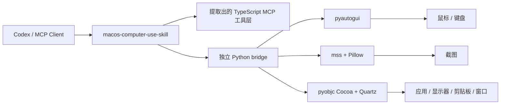

<div align="center">
  
  <h1>macOS Computer-Use Skill</h1>
  <p><strong>一个面向 macOS 的顶级可移植 skill，内置独立 runtime 与 MCP server。</strong></p>
  <p>
    <a href="https://github.com/wimi321/macos-computer-use-skill">GitHub</a>
    ·
    <a href="https://clawhub.ai/wimi321/computer-use-macos">ClawHub</a>
    ·
    <a href="./README.md">English</a>
    ·
    <a href="./README.ja.md">日本語</a>
  </p>
</div>

## ClawHub 安装

这个 skill 已发布到 ClawHub，slug 是 [`computer-use-macos`](https://clawhub.ai/wimi321/computer-use-macos)。

```bash
clawhub install computer-use-macos
```

如果你还想拿到完整源码仓库，下面继续看 GitHub 方式。

## 项目定位

这个仓库本质上同时是：

- 一个顶级 `skill`
- 一套独立的 macOS runtime
- 一个给 agent 生态使用的 computer-use MCP server

它不只是给 Codex 用，skill 这种交付方式本身就是为了跨 agent 生态可移植。

## 这个项目解决什么问题

目标只有一个：

- 不依赖本机 Claude
- 不依赖私有 `.node` 二进制
- 不依赖“先从某个安装目录里捞内部资产”
- skill 装上之后就能把 computer-use 跑起来

这版仓库已经按这个目标重构完成。

## 你现在拿到的能力

- 顶级 macOS computer-use skill
- 独立 MCP server：截图、鼠标、键盘、应用启动、窗口/显示器信息、剪贴板
- 只使用公开依赖：`Node.js + Python + pyautogui + mss + Pillow + pyobjc`
- 首次运行自动自举：自动创建 `.runtime/venv` 并安装 Python 依赖
- 安装 skill 时会把完整项目一起复制到 `~/.codex/skills/computer-use-macos/project`
- 保留并复用提取出来的 TypeScript computer-use 工具链，但底层执行器已换成真正独立的 runtime

## 已完成的本地验证

已经在 macOS 本机实际验证：

- runtime 自举成功
- 权限检测成功
- 显示器枚举成功
- 截图成功
- 前台应用识别成功
- 鼠标位置对应应用识别成功
- 窗口到显示器的归属解析成功
- 剪贴板读写成功
- 输入链路 smoke test 成功
- MCP server 成功启动

## 架构



## 安装

### 1. 克隆并安装 Node 依赖

```bash
git clone https://github.com/wimi321/macos-computer-use-skill.git
cd macos-computer-use-skill
npm install
npm run build
```

### 2. 启动 server

```bash
node dist/cli.js
```

首次启动时项目会自动：

- 创建 `.runtime/venv`
- 必要时自动补 `pip`
- 根据 `runtime/requirements.txt` 安装 Python 运行时依赖

不需要 Claude Desktop。也不需要任何私有 native 模块。

## MCP 配置

示例：

```json
{
  "mcpServers": {
    "computer-use": {
      "command": "node",
      "args": [
        "/absolute/path/to/macos-computer-use-skill/dist/cli.js"
      ],
      "env": {
        "CLAUDE_COMPUTER_USE_DEBUG": "0",
        "CLAUDE_COMPUTER_USE_COORDINATE_MODE": "pixels"
      }
    }
  }
}
```

参考 [`examples/mcp-config.json`](./examples/mcp-config.json)。

## Skill 安装

仓库自带顶级 skill：[`skill/computer-use-macos`](./skill/computer-use-macos)

你现在可以通过 ClawHub 直接安装，也可以从这个仓库本地安装。

### 方式 A：从 ClawHub 安装

```bash
clawhub install computer-use-macos
```

### 方式 B：从仓库安装

安装：

```bash
bash skill/computer-use-macos/scripts/install.sh
```

安装脚本会一起复制：

- skill 元数据
- 独立项目本体
- runtime 自举文件

安装后默认项目路径为：

```bash
~/.codex/skills/computer-use-macos/project
```

也就是说，即使原始 clone 被删掉，已安装的 skill 仍然有自己的可运行项目副本。

## 运行说明

### 权限

macOS 仍然需要：

- Accessibility
- Screen Recording

这个 standalone host 会在 MCP 流程中检测并反馈这两项状态。

### 截图过滤

当前 standalone runtime 声明的是 `screenshotFiltering: none`。

含义是：

- 截图本身不是 compositor 级过滤
- 但操作权限、allowlist、tier 限制仍由 MCP 层逻辑继续执行

### 平台范围

当前项目明确只支持 `macOS` 桌面 computer use，这一版还不是 Windows 或 Linux backend。

当前覆盖：

- 截图
- 鼠标控制
- 键盘输入
- 前台应用识别
- 已安装 / 运行中应用枚举
- 窗口到显示器映射
- 剪贴板访问
- 应用启动

## 常用命令

```bash
npm run build
node dist/cli.js
```

```bash
node --input-type=module -e "import { callPythonHelper } from './dist/computer-use/pythonBridge.js'; console.log(await callPythonHelper('list_displays', {}));"
```

## 仓库结构

```text
src/
  computer-use/
    executor.ts
    hostAdapter.ts
    pythonBridge.ts
  vendor/computer-use-mcp/
runtime/
  mac_helper.py
  requirements.txt
skill/
  computer-use-macos/
examples/
assets/
```

## 可选环境变量

- `CLAUDE_COMPUTER_USE_DEBUG=1`
- `CLAUDE_COMPUTER_USE_COORDINATE_MODE=pixels`
- `CLAUDE_COMPUTER_USE_CLIPBOARD_PASTE=1`
- `CLAUDE_COMPUTER_USE_MOUSE_ANIMATION=1`
- `CLAUDE_COMPUTER_USE_HIDE_BEFORE_ACTION=0`

## 路线图

- 更好的 app icon 提取
- 更稳的嵌套 helper app 过滤
- 更完整的 MCP 集成测试
- 提供更易分发的打包产物

## License

MIT

## Credits

这个项目保留了从 Claude Code computer-use 工作流中提炼出来的可复用 TypeScript 逻辑，并用一套完全独立、公开可安装的 macOS runtime 替换了缺失的私有执行层。
