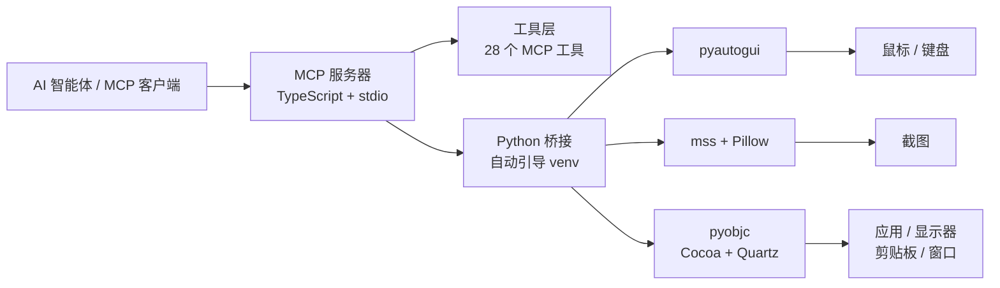

<p align="right">
  <a href="./README.md">English</a> ·
  <a href="./README.ja.md">日本語</a>
</p>

<div align="center">
  
  <h1>macOS Computer-Use Skill</h1>
  <p><strong>独立 MCP 服务器，让 AI 智能体完整控制 macOS 图形界面 — 截图、鼠标、键盘、应用、剪贴板、多显示器 — 零私有依赖。</strong></p>
  <br />
  <p>
    
    
    
    
    
    
  </p>
  <p>
    <a href="#快速开始">快速开始</a> ·
    <a href="#工具列表">工具列表</a> ·
    <a href="#mcp-配置">MCP 配置</a> ·
    <a href="https://clawhub.ai/wimi321/computer-use-macos">ClawHub</a>
  </p>
</div>

---

## 核心能力

| | 能力 | 说明 |
|---|---|---|
| **视觉** | 截图与显示器 | 截取任意显示器画面，枚举监视器，区域放大 |
| **输入** | 鼠标与键盘 | 点击、拖拽、滚动、输入文本、组合键、长按 — 内置 IME 安全的剪贴板路由 |
| **应用** | 应用控制 | 启动应用、识别前台应用、列举已安装/运行中的应用、分层权限模型 |
| **剪贴板** | 读写 | 完整剪贴板访问，支持粘贴驱动的工作流 |
| **批量** | 动作批处理 | 在单次 MCP 调用中链式执行多个操作 |
| **运行时** | 零配置启动 | 首次运行自动创建 Python virtualenv 并安装依赖 |
| **可移植** | Skill 打包 | 作为独立 skill 分发 — 安装即用，不依赖源码仓库 |
| **公开** | 无私有依赖 | 完全基于公开包构建：Node.js、Python、pyautogui、mss、Pillow、pyobjc |

## 快速开始

**1. 克隆并构建**

```bash
git clone https://github.com/wimi321/macos-computer-use-skill.git
cd macos-computer-use-skill
npm install && npm run build
```

**2. 启动 MCP 服务器**

```bash
node dist/cli.js
```

首次启动时服务器会自动在 `.runtime/venv` 中创建 Python 虚拟环境并安装所有运行时依赖。不需要 Claude 桌面应用，不需要任何私有原生模块。

**3. 或从 ClawHub 安装**

```bash
clawhub install computer-use-macos
```

> [!NOTE]
> macOS 要求宿主进程具备 **辅助功能（Accessibility）** 和 **屏幕录制（Screen Recording）** 权限。服务器启动时会自动检测并通过 MCP 上报状态。

## 架构



## 工具列表

### 视觉与显示器

| 工具 | 说明 |
|---|---|
| `screenshot` | 将当前显示器截图为 JPEG 图像 |
| `zoom` | 裁切并放大上一张截图的指定区域 |
| `switch_display` | 将截图目标切换到另一个显示器 |

### 输入

| 工具 | 说明 |
|---|---|
| `left_click` | 在指定坐标左键单击 |
| `double_click` | 双击 |
| `triple_click` | 三击（选择整段/整行） |
| `right_click` | 右键（上下文菜单） |
| `middle_click` | 中键点击 |
| `left_click_drag` | 在两点之间拖拽 |
| `left_mouse_down` | 按下并保持左键 |
| `left_mouse_up` | 释放左键 |
| `mouse_move` | 移动光标但不点击 |
| `scroll` | 在指定坐标向任意方向滚动 |
| `type` | 输入文本（macOS 上使用剪贴板路由以规避 IME 问题） |
| `key` | 按下组合键（如 `cmd+c`、`ctrl+shift+t`） |
| `hold_key` | 按住某个键一段时间 |
| `cursor_position` | 获取当前光标坐标 |

### 应用与系统

| 工具 | 说明 |
|---|---|
| `open_application` | 按名称启动 macOS 应用 |
| `request_access` | 请求与某个应用交互的权限 |
| `list_granted_applications` | 列出当前会话已授权控制的应用 |
| `read_clipboard` | 读取系统剪贴板 |
| `write_clipboard` | 写入系统剪贴板 |
| `wait` | 暂停指定时长 |

### 批量与教学模式

| 工具 | 说明 |
|---|---|
| `computer_batch` | 在单次调用中执行多个操作 |
| `request_teach_access` | 请求教学工作流的提升权限 |
| `teach_step` | 教学模式下的单步操作 |
| `teach_batch` | 教学模式下的批量操作 |

## MCP 配置

添加到你的 MCP 客户端配置中：

```json
{
  "mcpServers": {
    "computer-use": {
      "command": "node",
      "args": ["/absolute/path/to/macos-computer-use-skill/dist/cli.js"],
      "env": {
        "CLAUDE_COMPUTER_USE_DEBUG": "0",
        "CLAUDE_COMPUTER_USE_COORDINATE_MODE": "pixels"
      }
    }
  }
}
```

完整示例参考 [`examples/mcp-config.json`](./examples/mcp-config.json)。

## Skill 安装

本项目以自包含 skill 形式分发，位于 [`skill/computer-use-macos`](./skill/computer-use-macos)。

**从 ClawHub 安装：**

```bash
clawhub install computer-use-macos
```

**从仓库安装：**

```bash
bash skill/computer-use-macos/scripts/install.sh
```

安装器会将完整项目复制到 `~/.codex/skills/computer-use-macos/project` — 即使删除原始克隆，skill 仍可正常工作。

## 环境变量

| 变量 | 默认值 | 说明 |
|---|---|---|
| `CLAUDE_COMPUTER_USE_DEBUG` | `0` | 启用详细调试日志 |
| `CLAUDE_COMPUTER_USE_COORDINATE_MODE` | `pixels` | 坐标模式：`pixels` 或 `normalized_0_100` |
| `CLAUDE_COMPUTER_USE_CLIPBOARD_PASTE` | `1` | 优先使用剪贴板输入（规避 IME 问题） |
| `CLAUDE_COMPUTER_USE_MOUSE_ANIMATION` | `0` | 鼠标移动动画 |
| `CLAUDE_COMPUTER_USE_HIDE_BEFORE_ACTION` | `0` | 操作前隐藏遮罩窗口 |

## 系统要求

| 要求 | 版本 |
|---|---|
| macOS | 12+（Monterey 或更高） |
| Node.js | 20+ |
| Python | 3.10+（macOS 自带或通过 Homebrew 安装） |
| 权限 | 辅助功能 + 屏幕录制 |

Python 依赖（`pyautogui`、`mss`、`Pillow`、`pyobjc`）会在首次运行时自动安装到独立的虚拟环境中。

## 仓库结构

```
macos-computer-use-skill/
├── src/
│   ├── cli.ts                    # 入口
│   ├── server.ts                 # MCP 服务器配置
│   ├── session.ts                # 会话上下文工厂
│   ├── computer-use/
│   │   ├── executor.ts           # macOS 执行器（桥接 Python）
│   │   ├── pythonBridge.ts       # Venv 引导 + Python IPC
│   │   ├── hostAdapter.ts        # 宿主适配器工厂
│   │   └── ...
│   └── vendor/computer-use-mcp/
│       ├── mcpServer.ts          # MCP 服务器工厂
│       ├── toolCalls.ts          # 工具调度逻辑
│       ├── tools.ts              # MCP 工具 schema
│       └── ...
├── runtime/
│   ├── mac_helper.py             # Python 运行时（pyautogui + pyobjc）
│   └── requirements.txt
├── skill/
│   └── computer-use-macos/       # 可移植 skill 包
├── examples/
│   ├── mcp-config.json
│   └── env.sh.example
├── assets/
│   └── hero.svg
├── package.json
└── tsconfig.json
```

## 路线图

- [ ] 无需私有 API 的应用图标提取
- [ ] 更精准的嵌套 helper 应用过滤
- [ ] 自动化 MCP 集成测试套件
- [ ] 预构建发布产物以简化分发

## 贡献

欢迎贡献。请参阅 [CONTRIBUTING.md](./CONTRIBUTING.md) 了解指南。

## License

[MIT](./LICENSE)

## 致谢

本项目从 Claude Code 工作流中提取并复用了可重用的 TypeScript computer-use 逻辑，并用一套完全独立、公开可安装的 macOS 实现替换了私有原生运行时。基于 [Model Context Protocol](https://modelcontextprotocol.io) 构建。
